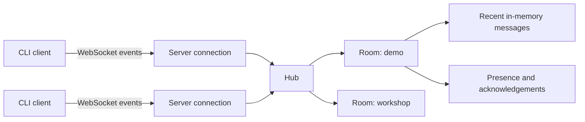

# SignalRoom

**Project site:** [flennium.github.io/SignalRoom](https://flennium.github.io/SignalRoom/)

The GitHub Pages site presents the browser interface, documentation, and responsive design. GitHub Pages cannot run a persistent WebSocket process, so live rooms require the Node.js server described below. The Pages build can connect to a separately hosted server by setting `VITE_SIGNALROOM_WS_URL` to its public `wss://` endpoint.

## Run the first vertical slice

Requirements: Node.js 24 or newer and npm 11 or newer.

```console
npm install
npm run dev
```

Open `http://127.0.0.1:5173` in two browser tabs, create a room, and publish a notice. The development web server proxies WebSocket traffic to the SignalRoom server on port 8080.

Build the web app and CLI, then start the production server:

```console
npm run build
node apps/cli/dist/index.js start
```

The production server serves the web interface and WebSocket endpoint from `http://127.0.0.1:8080`.

Connect from a terminal:

```console
node apps/cli/dist/index.js connect --room lobby --name Lina
```

See the [deployment guide](docs/DEPLOYMENT.md) for Docker, environment variables, TLS, health checks, and separately hosted browser configuration.

## Project documentation

- [Project plan](docs/PROJECT_PLAN.md) — scope, user journeys, technical choices, milestones, and first backlog.
- [Interface specification](docs/UI_SPEC.md) — visual direction, page layouts, components, responsive behavior, copy, and accessibility.
- [Architecture](docs/ARCHITECTURE.md) — workspace structure, application boundaries, connection lifecycle, reliability, security, tests, and CI.
- [Deployment](docs/DEPLOYMENT.md) — Docker, environment configuration, TLS, health checks, and release validation.

SignalRoom is a small, self-hosted coordination server for temporary groups. A host starts one server, people or scripts connect from a terminal, and everyone receives the same live stream of structured signals.

Instead of becoming another chat application, SignalRoom focuses on four kinds of communication that matter during workshops, hackathons, live demos, small incidents, and multiplayer testing:

- **notice** — information everyone should see;
- **question** — a prompt that needs an answer;
- **decision** — an outcome the group should remember;
- **action** — a request that recipients can acknowledge.

Messages are intentionally temporary. There are no accounts, profiles, feeds, or permanent chat history. The useful twist is acknowledgement: a sender can see whether a signal reached the connected group and who acknowledged an action. SignalRoom answers “did everyone receive this?” rather than merely “was this sent?”

> This concept combines familiar ideas—WebSocket broadcast, rooms, presence, and acknowledgements—in a deliberately narrow CLI tool. The claim is useful focus, not that no similar system has ever existed.

## The problem

Small groups often need a shared real-time channel for only an hour or a day. Existing chat products require accounts and workspaces, while raw WebSocket demos broadcast unstructured strings and stop being useful after the tutorial.

SignalRoom should be useful in situations such as:

- an instructor broadcasting exercise changes to a class;
- a hackathon organizer announcing checkpoints;
- a developer sending test events to several local clients;
- a small response team assigning and acknowledging actions;
- shell scripts publishing build, deploy, or device status during a demo.

The product goal is:

> Give a temporary group one fast, observable channel for important signals, with no setup beyond a server address and room key.

## Why this could earn a place beside existing tools

WebSocket broadcasting is established technology. Rooms, presence, and read receipts also already exist in other products. SignalRoom should therefore not be marketed as a new transport or a better general-purpose chat application.

Its opportunity is a smaller product category: a disposable coordination channel where every message states its purpose and important requests have an observable outcome.

| Alternative                      | What it does well                            | Friction for a temporary session                                                                 | SignalRoom's focused advantage                                      |
| -------------------------------- | -------------------------------------------- | ------------------------------------------------------------------------------------------------ | ------------------------------------------------------------------- |
| Slack, Discord, or Teams         | Rich, durable team communication             | Accounts, workspaces, channels, notifications, and permanent history                             | One command to host, one room key to join, and no lasting workspace |
| A basic WebSocket chat demo      | Teaches connections and broadcasting         | Messages are unstructured and there is no proof that an action was noticed                       | Typed signals, acknowledgements, presence, and recent context       |
| MQTT, NATS, or Redis Pub/Sub     | Reliable infrastructure for software systems | Designed around topics, brokers, and programmatic consumers rather than a human terminal session | Human-readable CLI experience with no broker vocabulary required    |
| Sending messages in a group chat | Familiar and already installed               | Important actions become mixed with conversation and acknowledgement is ambiguous                | A short signal stream designed around notice, decision, and action  |

This is expected to work better only for a specific situation: a trusted group needs a shared live channel for the next few minutes or hours and wants to know whether an important action was seen. It will be worse than existing chat products for ongoing conversation and worse than established message brokers for production application infrastructure.

The riskiest assumption is that acknowledgements are useful enough to make people choose another tool. Test that before adding more features:

1. Run SignalRoom during three real workshops, demos, or group test sessions.
2. Observe whether participants send actions and use `/ack` without repeated prompting.
3. Ask hosts whether the acknowledgement count prevented them from repeating an instruction.
4. Continue only if at least two hosts ask to use it again.

The memorable product sentence is:

> SignalRoom is a temporary command room for people and scripts: send a notice, decision, or action and see who acknowledged it.

## MVP

The first release has a browser interface for participants and an installable CLI named `signalroom` with two modes:

```text
signalroom start
signalroom connect
```

Both interfaces use the same WebSocket protocol. Together they satisfy the original broadcast-server exercise and add only the features needed to make it useful:

1. A WebSocket server accepts multiple concurrent clients.
2. A client can join a named room with a display name.
3. A message from one client is broadcast to every client in that room, including the sender.
4. Messages have a type: `notice`, `question`, `decision`, or `action`.
5. Clients can acknowledge a message by ID.
6. New clients receive the most recent 50 messages in their room.
7. Join, leave, reconnect, malformed input, and shutdown are handled cleanly.
8. All data stays in memory and disappears when the server stops.

Rooms keep unrelated groups separate, but there is no room administration in the MVP. Possession of the room key grants access.

## Example experience

Start a server:

```console
$ signalroom start --host 0.0.0.0 --port 8080
SignalRoom listening on ws://0.0.0.0:8080/ws
Press Ctrl+C to stop gracefully.
```

Connect from two terminals:

```console
$ signalroom connect --url ws://localhost:8080/ws --room demo --name sam
Connected to room "demo" as sam. 2 participants online.

Commands: /notice /question /decision /action /ack /who /help /quit
> /action Restart the test client before 15:30
[a8f2] sam · ACTION · Restart the test client before 15:30
```

```console
$ signalroom connect --url ws://localhost:8080/ws --room demo --name lina
Connected to room "demo" as lina. 2 participants online.
[a8f2] sam · ACTION · Restart the test client before 15:30
> /ack a8f2
[a8f2] acknowledged by lina (1/2 online)
```

Plain text defaults to a notice:

```text
> The API is available again
[b91c] lina · NOTICE · The API is available again
```

## CLI contract

### Start the server

```text
signalroom start [options]

Options:
  --host <address>       Bind address                         default: 127.0.0.1
  --port <number>        Listening port                      default: 8080
  --history <count>      Messages retained per room          default: 50
  --max-clients <count>  Maximum simultaneous connections   default: 100
  --room-key <key>       Allow only this room key            optional
```

Binding to `127.0.0.1` is the safe default for local development. A host explicitly chooses `0.0.0.0` to accept other machines on the network.

### Connect a client

```text
signalroom connect [options]

Options:
  --url <websocket-url>  Server endpoint                     default: ws://localhost:8080/ws
  --room <key>           Room to join                        default: lobby
  --name <display-name>  Name shown to other clients         required
  --reconnect            Retry interrupted connections       default: true
```

### Interactive commands

| Command             | Behavior                                           |
| ------------------- | -------------------------------------------------- |
| `/notice <text>`    | Broadcast information. Plain text is equivalent.   |
| `/question <text>`  | Broadcast a question.                              |
| `/decision <text>`  | Broadcast a recorded decision.                     |
| `/action <text>`    | Broadcast an action that can be acknowledged.      |
| `/ack <message-id>` | Acknowledge a visible message.                     |
| `/who`              | Show participants currently connected to the room. |
| `/help`             | Show local help.                                   |
| `/quit`             | Disconnect cleanly.                                |

## Wire protocol

Every WebSocket frame contains one UTF-8 JSON object. The `type` field determines the event shape. Protocol version 1 uses the following client-to-server events.

Join immediately after opening the socket:

```json
{
  "type": "join",
  "protocol": 1,
  "room": "demo",
  "name": "lina"
}
```

Publish a signal:

```json
{
  "type": "publish",
  "kind": "action",
  "text": "Restart the test client before 15:30"
}
```

Acknowledge a signal:

```json
{
  "type": "ack",
  "messageId": "a8f2c910"
}
```

The server is authoritative for IDs, timestamps, room membership, and sender identity. A broadcast message looks like this:

```json
{
  "type": "signal",
  "protocol": 1,
  "id": "a8f2c910",
  "room": "demo",
  "kind": "action",
  "text": "Restart the test client before 15:30",
  "sender": {
    "id": "client_7f31",
    "name": "sam"
  },
  "createdAt": "2026-09-20T14:30:00Z",
  "acknowledgedBy": []
}
```

Other server events are `welcome`, `presence`, `acknowledged`, `history`, `error`, and `shutdown`. Error events use stable machine-readable codes such as `INVALID_EVENT`, `NOT_JOINED`, `ROOM_FULL`, and `MESSAGE_TOO_LARGE`.

## Rules and limits

Keeping explicit limits makes the server predictable and prevents accidental abuse:

- one connection belongs to one room;
- display names are 1–32 visible characters;
- room keys are 1–64 URL-safe characters;
- message bodies are 1–2,000 characters;
- JSON frames are limited to 8 KiB;
- a client may publish at most 10 messages in 5 seconds;
- duplicate names are allowed because identity comes from the server-generated client ID;
- acknowledgements are idempotent;
- a client cannot acknowledge a message outside its room;
- invalid input returns an error event without crashing the connection unless the violation makes the connection unsafe.

## Suggested implementation

The suggested first implementation uses TypeScript on Node.js. The same language can power the server, interactive CLI, protocol types, tests, and browser client. It also keeps the WebSocket behavior visible instead of hiding it behind a large framework.

Suggested packages:

- `commander` for the `start` and `connect` commands;
- `ws` for the WebSocket server and client;
- `zod` for validating events at the network boundary;
- `readline/promises` from Node.js for the interactive terminal client;
- `vitest` for protocol, hub, and integration tests;
- `tsup` for producing a small distributable CLI bundle.

Target the current Node.js LTS release and declare the supported version in `package.json`. During development, run TypeScript directly with `tsx`; build JavaScript into `dist/` for releases. A user can then install the command through npm or run it with `npx`.

A small internal structure is enough:

```text
src/
  cli.ts              CLI entry point
  commands/
    start.ts          Server command and flags
    connect.ts        Interactive client command
  protocol/           Event schemas, types, and validation
  hub/                Rooms, clients, history, broadcast, acknowledgements
  server/             HTTP and WebSocket lifecycle
  client/             Terminal input, output, and reconnect behavior
test/
  hub.test.ts
  integration.test.ts
```

The central `Hub` owns all room state. The Node.js event loop serializes ordinary state changes, while each client gets a bounded outbound queue. A slow client is disconnected when its queue remains full, so it cannot block delivery to everyone else. Keep the hub independent of WebSocket objects so its behavior can be tested with plain function calls.



## Delivery plan

### Milestone 1: broadcast core

- Implement `signalroom start` and `signalroom connect`.
- Join the default room and exchange plain-text notices.
- Track connections and remove them on disconnect.
- Support Ctrl+C shutdown for both server and client.

**Done when:** three terminals can connect, every message reaches all three exactly once, and any terminal can leave without affecting the others.

### Milestone 2: useful signals

- Add named rooms and display names.
- Add the four signal kinds and formatted terminal output.
- Add server-generated IDs and acknowledgements.
- Add `/who` and presence events.

**Done when:** an action sent from one client can be acknowledged by another and every connected client sees the updated acknowledgement state.

### Milestone 3: resilience

- Retain and replay the latest messages in memory.
- Add bounded queues, size limits, validation, and rate limiting.
- Add client reconnect with exponential backoff and jitter.
- Add structured server logs and protocol error codes.

**Done when:** reconnecting clients recover recent context, malformed clients cannot crash the server, and a slow client cannot stall a room.

### Milestone 4: release

- Add unit tests for protocol validation and hub state transitions.
- Add an integration test with several real WebSocket connections.
- Build and test the npm package on Linux, macOS, and Windows.
- Record a short browser-and-terminal demo and publish the protocol documentation.

**Done when:** a new user can install the CLI, start a room, and connect from a second machine's browser by following only this README.

Native executables can be evaluated later if users object to installing Node.js.

## MVP acceptance tests

The release should pass these observable scenarios:

1. Start a server, connect three clients, and verify a signal from each is received by all three.
2. Disconnect one client abruptly, then verify the remaining clients can continue publishing.
3. Connect clients to two rooms and verify no event crosses room boundaries.
4. Publish an action, acknowledge it twice from the same client, and verify only one acknowledgement is counted.
5. Join after several messages and verify history arrives before new live messages are displayed.
6. Send invalid JSON, an unknown event, and an oversized message; verify the server stays healthy and returns the correct errors.
7. Stop the server with Ctrl+C and verify connected clients receive a shutdown event before their sockets close.
8. Simulate a client that never reads; verify other clients still receive messages promptly.

## GitHub and deployment

GitHub is a good home for the source code, issues, pull requests, documentation, and downloadable releases. GitHub Actions can run tests and build the CLI whenever a change is pushed.

GitHub Pages cannot run the SignalRoom server. Pages publishes static HTML, CSS, and browser JavaScript; it does not keep a Node.js process or WebSocket listener running. It can host the documentation or a separately deployed copy of the browser client, but that client must connect to a server deployed elsewhere.

A practical layout is:

```text
GitHub repository
├── TypeScript source and tests
├── GitHub Actions checks and release builds
├── GitHub Pages documentation or optional web client
└── deployment configuration for the server host

WebSocket host
└── continuously running SignalRoom Node.js server
```

For development, run the server locally or inside GitHub Codespaces. Codespaces is a cloud development environment and can expose a port for testing, but it should not be treated as permanent production hosting.

For a public demo, choose a service that explicitly supports long-lived WebSocket connections and a continuously running Node.js process. Hosting terms, sleep behavior, and free tiers change frequently, so verify those details when selecting a provider. For a private local event, running `signalroom start --host 0.0.0.0` on one participant's computer may be the simplest deployment.

## What is deliberately outside the MVP

These features would hide the WebSocket lessons under product complexity, so they should wait until real users request them:

- user accounts and identity providers;
- permanent database storage;
- file uploads and media;
- direct messages;
- message editing and deletion;
- end-to-end encryption;
- public internet discovery;
- bots, plugins, and webhooks.

TLS is still required before exposing the server to the public internet. For early releases, document how to place SignalRoom behind a reverse proxy that provides `wss://` rather than implementing certificate management in the application.

## Measures of success

The project is successful when it proves both a technical and a product hypothesis:

- **Technical:** one server can keep 100 local clients connected and broadcast a small message with no obvious delay or lost events under normal conditions.
- **Product:** a group uses SignalRoom for a real session and the acknowledgement feature answers a question they would otherwise ask aloud or repeat in chat.
- **Learning:** the implementation makes connection lifecycle, backpressure, protocol design, reconnects, and graceful shutdown visible and testable.

Avoid optimizing for stars or feature count in the first release. The strongest proof is one group using the tool twice.

## Possible follow-up directions

After the MVP has real usage, choose one direction rather than expanding in every direction:

1. **Automation relay:** add API tokens and stdin/JSON modes so CI jobs and scripts can publish typed events.
2. **Workshop mode:** add polls, timers, and anonymous “I need help” signals for classrooms.
3. **Incident mode:** add action ownership, deadlines, and an exportable session timeline.
4. **Local-first mode:** add LAN discovery and optional encrypted peer-friendly rooms for events with unreliable internet.

The acknowledgement model is the thread connecting all four. Any new feature should help a temporary group send, notice, or act on an important signal.

## Initial engineering decisions

| Decision        | Choice                                | Reason                                                                                                                              |
| --------------- | ------------------------------------- | ----------------------------------------------------------------------------------------------------------------------------------- |
| Transport       | WebSocket with JSON events            | Easy to inspect while learning and usable from terminals, browsers, and scripts.                                                    |
| State           | In memory                             | Keeps the MVP focused and reinforces its temporary-room identity.                                                                   |
| Delivery        | At most once per active connection    | Honest, simple semantics for an in-memory server. Reconnect history reduces inconvenience without pretending to guarantee delivery. |
| Broadcast scope | Room members, including sender        | The sender receives the same authoritative event and ID as everyone else.                                                           |
| Concurrency     | One hub owns mutable room state       | Reduces locking mistakes and makes state transitions testable.                                                                      |
| Slow clients    | Bounded queue, then disconnect        | Protects the room from one stalled connection.                                                                                      |
| Authentication  | Shared room key                       | Enough for trusted local groups; stronger identity can follow demonstrated need.                                                    |
| Compatibility   | Version in the join and server events | Allows protocol changes to fail clearly instead of behaving unpredictably.                                                          |

## License

Choose a permissive license such as MIT or Apache-2.0 before accepting outside contributions. Add the actual license file with the first implementation release.
