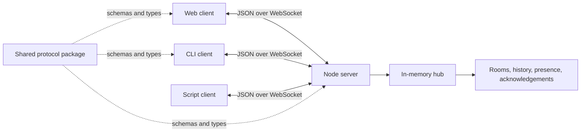
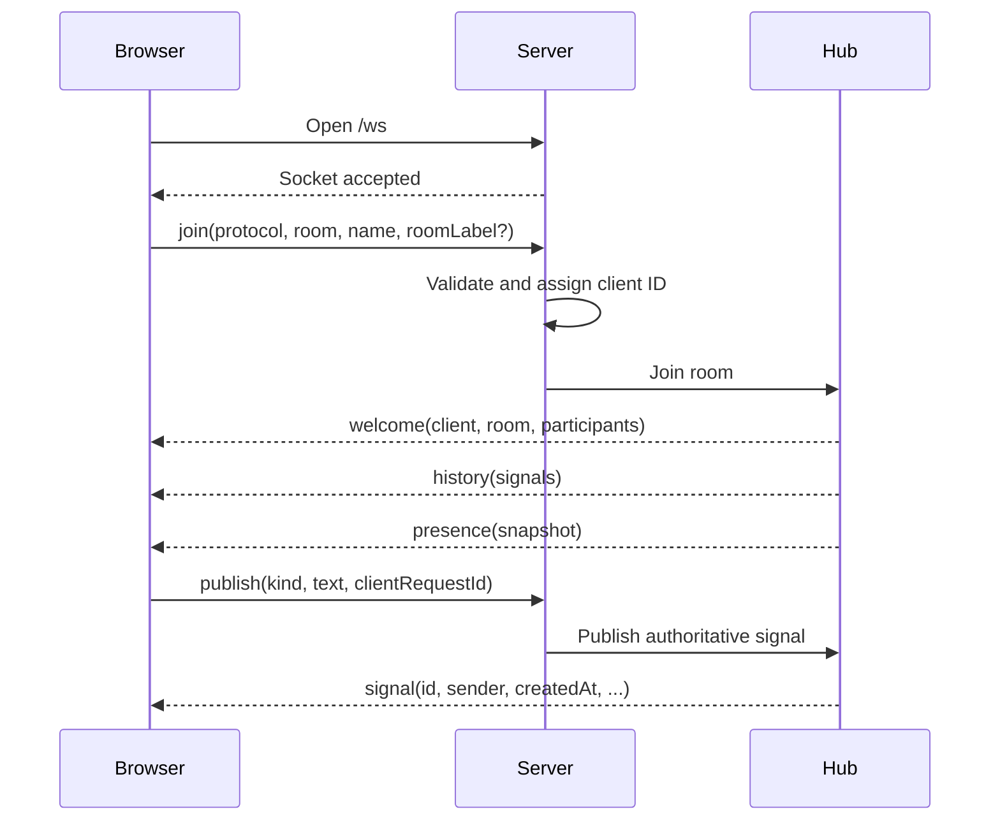

# SignalRoom architecture

## 1. System shape

SignalRoom is one TypeScript workspace with three runnable applications and one shared protocol package.



The production server can also serve the built web assets. That gives the browser UI and WebSocket endpoint one origin.

## 2. Repository structure

```text
signalroom/
├── apps/
│   ├── server/
│   │   ├── src/
│   │   │   ├── index.ts
│   │   │   ├── config.ts
│   │   │   ├── http-server.ts
│   │   │   ├── websocket-server.ts
│   │   │   ├── connection.ts
│   │   │   ├── hub.ts
│   │   │   ├── room.ts
│   │   │   ├── rate-limit.ts
│   │   │   └── shutdown.ts
│   │   └── test/
│   ├── web/
│   │   ├── src/
│   │   │   ├── main.tsx
│   │   │   ├── app.tsx
│   │   │   ├── routes/
│   │   │   ├── components/
│   │   │   ├── room/
│   │   │   │   ├── room-client.ts
│   │   │   │   ├── room-reducer.ts
│   │   │   │   └── use-room.ts
│   │   │   ├── styles/
│   │   │   │   ├── tokens.css
│   │   │   │   └── global.css
│   │   │   └── test/
│   │   └── e2e/
│   └── cli/
│       ├── src/
│       │   ├── index.ts
│       │   ├── commands/
│       │   ├── client.ts
│       │   └── renderer.ts
│       └── test/
├── packages/
│   └── protocol/
│       ├── src/
│       │   ├── client-events.ts
│       │   ├── server-events.ts
│       │   ├── models.ts
│       │   ├── limits.ts
│       │   └── index.ts
│       └── test/
├── docs/
│   ├── PROJECT_PLAN.md
│   ├── UI_SPEC.md
│   └── ARCHITECTURE.md
├── .github/
│   └── workflows/
│       ├── ci.yml
│       └── release.yml
├── package.json
├── pnpm-workspace.yaml
├── tsconfig.base.json
├── eslint.config.js
├── prettier.config.js
├── LICENSE
└── README.md
```

This structure separates deployable programs while sharing only the network contract. Do not create a general shared utilities package; code should remain local until two applications need the exact same behavior.

## 3. Package responsibilities

### `packages/protocol`

- Own Zod schemas for every wire event.
- Export inferred TypeScript types.
- Own protocol version and shared limits.
- Contain example fixtures for tests and documentation.
- Never import React, Node server modules, or application state.

### `apps/server`

- Upgrade HTTP connections at `/ws`.
- Validate every incoming frame before it reaches room state.
- Assign client IDs, message IDs, and server timestamps.
- Own rooms, presence, bounded history, and acknowledgements.
- Enforce size, rate, and participant limits.
- Serve health endpoints and production web assets.
- Shut down gracefully.

### `apps/web`

- Render home, join, and room experiences.
- Manage one WebSocket connection per room tab.
- Reduce server events into local display state.
- Preserve an unpublished draft through reconnects.
- Store only display name and UI preferences locally.
- Treat server events as authoritative.

### `apps/cli`

- Start the server or connect as a participant.
- Parse slash commands into protocol events.
- Render server events for a terminal.
- Support piped input and JSON output later only if requested by real users.

## 4. Server state model

```ts
type HubState = {
  rooms: Map<RoomKey, Room>;
};

type Room = {
  key: RoomKey;
  label: string;
  clients: Map<ClientId, ClientSession>;
  history: Signal[];
  acknowledgements: Map<MessageId, Set<ClientId>>;
};
```

The server owns mutable state. The browser never invents final IDs or acknowledgement counts. A room is deleted when its final client disconnects only after a short grace period; this allows brief reconnects without immediately losing history. Set the initial grace period to five minutes and make it a server constant, not a user-facing setting.

Room labels come from the first successful join and remain fixed for the room lifetime. Later joiners receive the authoritative label in `welcome`.

## 5. Connection lifecycle



The client must send `join` within five seconds of opening the socket. Until accepted, other events receive `NOT_JOINED`. Live events are queued while a connection receives its history snapshot, preventing history and new signals from appearing out of order.

## 6. Event model

### Client to server

- `join`
- `publish`
- `ack`
- `ping`

### Server to client

- `welcome`
- `history`
- `signal`
- `acknowledged`
- `presence`
- `error`
- `shutdown`
- `pong`

Every event includes `type`. Server events include `protocol` and `serverTime`. Publish events include a client-generated `clientRequestId`; the server echoes it in the resulting signal or error so the web UI can reconcile a pending action without duplicating it.

Do not implement optimistic signal insertion in the MVP. Show `Publishing…` on the composer until the authoritative signal returns. This makes delivery semantics honest and simplifies reconnect behavior.

## 7. Browser state

Use a reducer rather than a global state library:

```ts
type RoomViewState = {
  connection: 'connecting' | 'connected' | 'reconnecting' | 'offline';
  self: Participant | null;
  room: RoomSummary | null;
  participants: Participant[];
  signals: Signal[];
  draft: DraftSignal;
  publishState: 'idle' | 'publishing' | 'rate-limited';
  lastError: RoomError | null;
};
```

The reducer consumes semantic actions produced by the WebSocket client. React components do not parse wire events directly.

## 8. Reliability decisions

- Delivery is at most once per active connection.
- Recent history reduces reconnect inconvenience but is not durable storage.
- Message IDs use UUIDv7 or another sortable collision-resistant server ID.
- History is capped at 50 signals per room.
- Each connection has a bounded send queue. If it remains full, close that client with a clear reason.
- The client reconnects with exponential backoff, jitter, and a maximum delay of 15 seconds.
- A heartbeat detects dead connections that did not close cleanly.
- Acknowledging the same signal twice is idempotent.
- History reconciliation deduplicates by message ID.

## 9. Security and privacy baseline

- Generate room keys with at least 128 bits of randomness; labels are never part of the key.
- Never put display names or message text into server logs by default.
- Validate event shape, string length, and enum values at runtime.
- Reject binary frames in protocol version 1.
- Limit frames to 8 KiB and messages to 2,000 characters.
- Apply per-connection publish limits and server-wide connection limits.
- Escape all displayed text through React; do not render user HTML.
- Require `wss://` outside localhost.
- Check the WebSocket `Origin` against configured allowed origins in hosted mode.
- Add standard HTTP security headers when serving the web client.
- Explain plainly that possession of the room link grants access and data is not end-to-end encrypted.

The MVP is appropriate for trusted temporary groups, not regulated or highly sensitive communication.

## 10. Configuration

Server configuration comes from flags first and environment variables second:

| Flag               | Environment                 | Default          |
| ------------------ | --------------------------- | ---------------- |
| `--host`           | `SIGNALROOM_HOST`           | `127.0.0.1`      |
| `--port`           | `SIGNALROOM_PORT`           | `8080`           |
| `--history`        | `SIGNALROOM_HISTORY`        | `50`             |
| `--max-clients`    | `SIGNALROOM_MAX_CLIENTS`    | `100`            |
| `--allowed-origin` | `SIGNALROOM_ALLOWED_ORIGIN` | Same origin only |

Fail fast on invalid configuration. Never silently bind to a wider network interface.

## 11. Test strategy

### Protocol tests

- Accept every documented event example.
- Reject missing, unknown, oversized, and wrong-version data.
- Verify limits are shared across applications.

### Hub tests

- Isolate rooms.
- Broadcast to all active room clients including sender.
- Remove disconnected clients.
- Keep history capped and ordered.
- Make acknowledgements idempotent.
- Delete empty rooms after the grace period.

### Server integration tests

- Connect several real WebSocket clients.
- Verify join-before-publish enforcement.
- Verify shutdown notification and socket closure.
- Verify a stalled client cannot block others.

### Web tests

- Unit test the room reducer.
- Component test validation and disconnected states.
- Use Playwright for create, join, publish, acknowledge, reconnect, and mobile-drawer flows.

Tests should target observable behavior and state transitions. Avoid snapshot tests for large rendered trees.

## 12. CI and release

Every pull request runs:

1. dependency install with a frozen lockfile;
2. formatting check;
3. lint;
4. TypeScript type-check;
5. unit and integration tests;
6. production builds;
7. Playwright smoke test on the supported Node.js LTS version.

Tagged releases publish the CLI package only after the same checks pass. Keep deployment separate from package publication so a failed host deployment cannot corrupt a release.

## 13. Architecture rules

1. The protocol package describes data; it performs no I/O.
2. The server is authoritative for shared state.
3. Application packages do not import from one another.
4. No database abstraction exists until persistence is approved as a product feature.
5. No generic component system exists until repeated UI patterns justify it.
6. A network behavior change requires a protocol test and documentation change.
7. A visible state must have defined loading, error, offline, and narrow-screen behavior.
